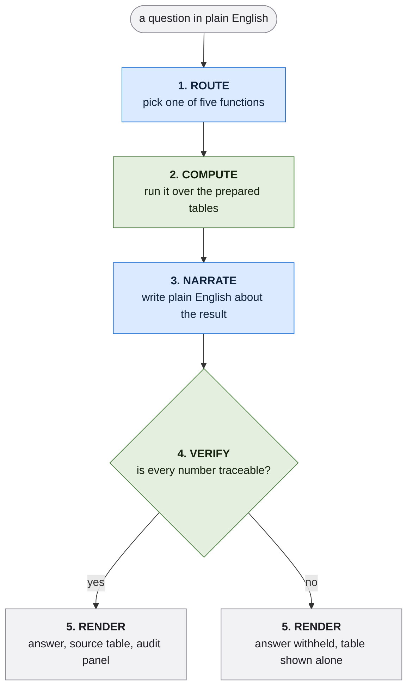

# How a question becomes an answer

Blue is the language model. Green is pure Python.

1. **Route.** Picks one of five prepared questions, or picks the option that says this data cannot answer that. Choosing is all it does here. It sees no rows and does no arithmetic.
2. **Compute.** The chosen function reads the prepared tables and returns a result carrying its own sample size, the filters that produced it, and any warnings the code attaches.
3. **Narrate.** Writes plain English about the result it was handed. It is given the figures already formatted for reading, because it is not allowed to convert anything.
4. **Verify.** Every number in the sentence is matched against the result. Anything that cannot be traced means the sentence is withheld and the table is shown on its own.
5. **Render.** The answer, the table it came from, and a panel naming the function that ran, its arguments and the sample size.

Two things are worth noticing about the shape.

**The model appears twice and computes at neither point.** It picks a question at step 1 and explains an answer at step 3. Steps 2 and 4 are ordinary Python. A wrong choice at step 1 is visible and recoverable, since the panel names the function that ran. An invented number would be neither, which is why step 4 exists.

**Refusal is a routing outcome, not a filter.** The option to decline sits alongside the five real questions, so the model selects it the same way it selects anything else. A keyword filter in front of the model would have refused legitimate questions, which is a worse failure than it sounds: asking what content to make is answerable here, through video length and sound.

The same five functions serve both answer paths. With no API key, steps 1 and 3 are handled by keyword rules and templates instead, and steps 2, 4 and 5 are unchanged. The figures are identical either way.

Scope on every answer: 1,000 trending videos from 802 creators, 2020-09-22 to 2020-12-21.
